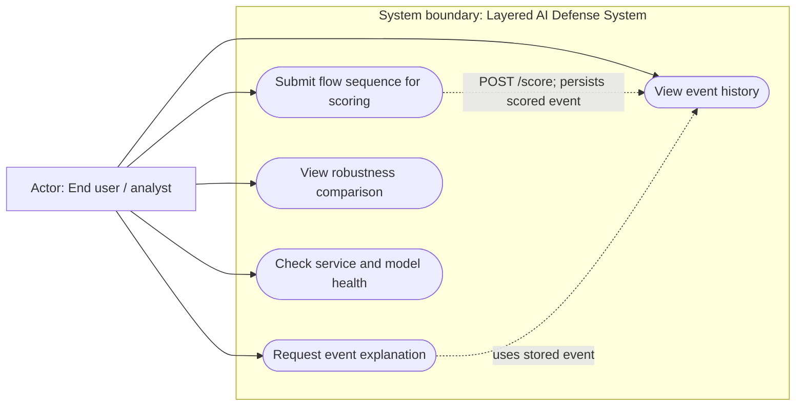
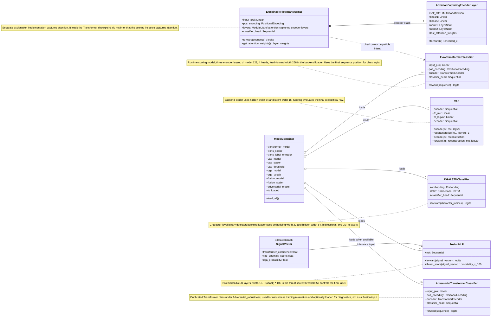
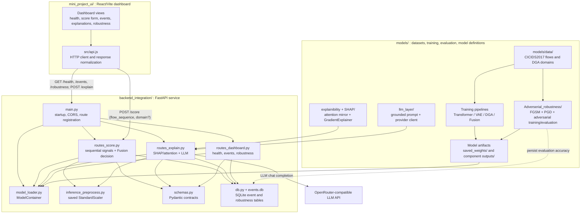

# UML and Architecture Diagrams

## 1. Purpose and Modeling Notes

This document describes the system present in the repository, rather than the original planned design. The diagrams reflect the implementation and the current backend contract as checked against [project_reference.md](../project_reference.md), `backend_integration/`, `models/`, and `mini_project_ui/`.

Important modeling distinctions:

- The `/score` route runs Transformer, VAE, and DGA inference **sequentially**. The diagram does not depict parallel detector calls.
- The Fusion threat score is the authoritative final detection decision. The Transformer predicted class is retained as an attack-type hint.
- The backend uses a trained Fusion MLP only when all three signals and the Fusion model/scaler are available. Otherwise it calculates a weighted fallback over active signals; with no usable signals it returns `insufficient_models`.
- Runtime scoring uses `models/transformer/model.py`. The explanation route separately loads an attention-capturing model implementation from `models/explainibility + SHAP/model.py` using the Transformer checkpoint.
- Scoring starts from the raw request matrix and independently applies the Transformer scaler and VAE scaler before invoking their respective models.
- The active dashboard's `scoreFlow` helper sends `flow_sequence`, matching the backend request schema. A valid score and event-history flow was smoke-tested with isolated persistence.
- In UML, the system is the subject boundary for the use-case diagram, rather than a separate external actor. The requested system context is shown as the boundary; the analyst is the external human actor.

## 2. Use-Case Diagram



The use cases are available through the HTTP service and dashboard presentation. The current dashboard score payload matches the backend schema; full browser-based interaction remains a separate manual demonstration check.

## 3. Core Model Class Diagram



The `SignalVector` is shown as a data contract rather than as a Python class. The VAE threshold is loaded as an artifact but does not set the `/score` final decision. `AdversarialTransformerClassifier` is a duplicate model definition under `models/Adverserial_robustness/`; it is not a new detector signal in the scoring Fusion vector.

## 4. Sequence Diagram: Flow Scoring

```mermaid
sequenceDiagram
    autonumber
    actor Client as Analyst / Dashboard Client
    participant API as FastAPI POST /score
    participant Prep as Inference Preprocessor
    participant Container as ModelContainer
    participant T as Transformer
    participant V as VAE
    participant D as DGA Detector
    participant F as Fusion MLP / Fallback
    participant DB as SQLite events

    Client->>API: JSON {flow_sequence, domain?}
    API->>Container: Ensure artifacts loaded
    API->>Prep: Validate 2D shape and expected feature width
    Prep->>Prep: Apply saved Transformer StandardScaler to raw sequence
    Prep-->>API: transformer_seq or validation error
    API->>Prep: Apply saved VAE scaler independently to raw sequence
    Prep-->>API: vae_seq or validation error

    alt Transformer loaded
        API->>T: Classify transformer_seq
        T-->>API: Class probabilities and argmax class hint
        API->>API: transformer_confidence = 1 - P(BENIGN)
    else Transformer unavailable
        API->>API: Initialize Transformer signal as unavailable/default
    end

    alt VAE loaded
        API->>V: Score final row of vae_seq
        V-->>API: Reconstruction and latent statistics
        API->>API: Compute MSE + 0.5 * KL anomaly signal
    else VAE unavailable
        API->>API: Initialize VAE signal as unavailable/default
    end

    alt Domain provided and DGA model/vocabulary loaded
        API->>D: Lowercase, encode, truncate/pad domain
        D-->>API: Class probabilities
        API->>API: dga_probability = P(class 1)
    else No usable domain signal
        API->>API: Mark DGA signal unavailable
    end

    alt All three signals and trained Fusion model/scaler available
        API->>F: Scale [transformer, VAE, DGA] signal vector
        F->>F: Compute P(attack) * 100
        F-->>API: threat_score 0..100
    else At least one detector signal available
        API->>F: Apply weighted fallback over active signals
        F-->>API: Partial threat_score 0..100
    else No usable detector signal
        API-->>Client: status=insufficient_models; no score
    end

    opt A score was produced
        API->>API: Apply threshold >= 50.0 for final attack decision
        API->>API: Use non-BENIGN Transformer class as attack type hint; otherwise ATTACK
        API->>DB: Insert score fields, classes, timestamp, raw sequence
        DB-->>API: Commit
        API-->>Client: ScoreResponse with status, score, classes, signals, event_id
    end
```

The detector messages are ordered because current `routes_score.py` evaluates Transformer, VAE, and DGA in sequence. In particular, no concurrent fork/join is implied. The request field shown is the actual backend contract and now matches the active dashboard helper. Transformer and VAE arrays are independently transformed from the raw request using their corresponding saved scalers. Replay of the stored DoS Hulk and PortScan inputs confirmed that API VAE scores match direct inference with the VAE scaler.

## 5. Sequence Diagram: Event Explanation

```mermaid
sequenceDiagram
    autonumber
    actor Client as Analyst / Dashboard Client
    participant API as FastAPI POST /explain
    participant DB as SQLite events
    participant Prep as Inference Preprocessor
    participant ExpModel as Attention-Capturing Transformer
    participant Attention as Attention Summary
    participant SHAP as SHAP GradientExplainer
    participant LLM as LLM Explanation Layer
    participant Provider as OpenRouter-compatible API

    Client->>API: JSON {event_id}
    API->>DB: SELECT event by event_id
    alt Event not found
        DB-->>API: No row
        API-->>Client: 404 Not Found
    else Stored event found
        DB-->>API: Stored labels, confidence, raw_sequence
        API->>API: Parse stored raw sequence
        API->>Prep: Validate dimensions and apply saved scaler
        Prep-->>API: Scaled event sequence
        API->>ExpModel: Load checkpoint-compatible explanation model
        API->>ExpModel: Forward pass for predicted class/confidence
        ExpModel-->>API: Logits and captured layer attention
        API->>Attention: Average final-layer heads; summarize attention from last token
        Attention-->>API: Top attended timesteps

        opt SHAP is installed and attribution succeeds
            API->>SHAP: Explain sequence using repeated event sequence as background
            SHAP-->>API: Feature attributions
            API->>API: Map top values to feature names and timesteps
        end

        alt Attribution pipeline raises an exception
            API->>API: Use current local fallback attribution payload
        else Attribution completes or SHAP is unavailable
            API->>API: Retain available attention and SHAP fields
        end

        API->>LLM: Structured attribution and class names
        LLM->>LLM: Build grounded prompt with attack signature
        LLM->>Provider: Chat completion request using server-side LLM_API_KEY
        alt Provider responds
            Provider-->>LLM: Plain-English explanation
            LLM-->>API: Explanation text
        else Key missing, provider unavailable, or call fails
            LLM-->>API: Error
            API->>API: Set explicit LLM-unavailable explanation text
        end
        API-->>Client: ExplainResponse with class, confidence, attention, SHAP, text
    end
```

The diagram shows SHAP as conditional because configuration may report it unavailable and the route catches attribution exceptions. The current exception branch uses example attribution values, which are not computed from the event and should be recognized as degraded fallback data. The LLM text is also optional; missing credentials do not prove the local attribution failed.

## 6. Component and Architecture Diagram



### 6.1 Component Responsibilities and Data Flow

1. **Data and model development:** flow and domain datasets in `models/data/` feed their respective preprocessing, training, and evaluation modules. The Fusion pipeline consumes detector signal data. The adversarial pipeline duplicates the Transformer model definition and performs FGSM/PGD evaluation and adversarial training as a separate study.
2. **Artifacts:** model definitions are implemented in their model folders, while artifact paths are selected by `backend_integration/config.py`. The backend configuration currently resolves Transformer artifacts from `models/saved_weights/`, VAE artifacts from `models/VAE/outputs/`, DGA artifacts from `models/DGA_detector/outputs/`, Fusion artifacts from `models/fusion_head/outputs/`, and adversarial weights from the central location with an output-folder fallback.
3. **Startup and serving:** `backend_integration/main.py` initializes SQLite and calls `ModelContainer.load_all()` during FastAPI lifespan startup. Routes share the process-level model container and Pydantic schemas.
4. **Scoring:** `/score` validates and scales input, computes available detector signals sequentially, selects trained Fusion or a documented fallback, derives the Fusion-threshold class, and persists a successful/partial score and raw sequence.
5. **Explanation:** `/explain` retrieves stored raw input, scales it, invokes an explanation-compatible Transformer plus attention and optional SHAP, then calls the canonical LLM layer. The OpenRouter-compatible provider is an external dependency and requires the server-side key.
6. **Dashboard and persistence:** `mini_project_ui/` calls the HTTP API; it does not import models. SQLite stores score events and robustness accuracy results. The dashboard sends the current `flow_sequence` request contract. The event schema does not retain the submitted domain.

**Model-data validity note:** the VAE scaler path is verified. The Fusion signal generator still pairs flow and domain test outputs by position/resizing, and the Fusion trainer partitions these test-derived signals again. Resolve that provenance/leakage issue before treating Fusion results as validated independent performance.

## 7. Diagram-to-Implementation Traceability

| Diagram element | Implementation location |
|---|---|
| System boundary, user-facing cases | `backend_integration/routes_score.py`, `routes_explain.py`, `routes_dashboard.py`, `mini_project_ui/src/components/Dashboard.jsx` |
| Transformer, VAE, DGA, Fusion classes | `models/transformer/model.py`, `models/VAE/model.py`, `models/DGA_detector/model.py`, `models/fusion_head/model.py` |
| Loaded model/artifact container | `backend_integration/model_loader.py`, with paths in `backend_integration/config.py` |
| Flow scaling | `backend_integration/inference_preprocess.py` |
| Fusion threshold and fallback | `backend_integration/routes_score.py`, `backend_integration/config.py` |
| Attention/SHAP explanation | `models/explainibility + SHAP/model.py`, `attention_explainer.py`, `shap_explainer.py`, `explainer.py` |
| Prompt and external LLM call | `models/llm_layer/llm_explanation.py`, `llm_prompting.py`, `llm_config.py` |
| Event and robustness persistence | `backend_integration/db.py`; endpoint reads in `routes_dashboard.py`; robustness writer in `models/Adverserial_robustness/evaluate.py` |
| Browser/API integration | `mini_project_ui/src/api.js`, `mini_project_ui/src/components/Dashboard.jsx` |
